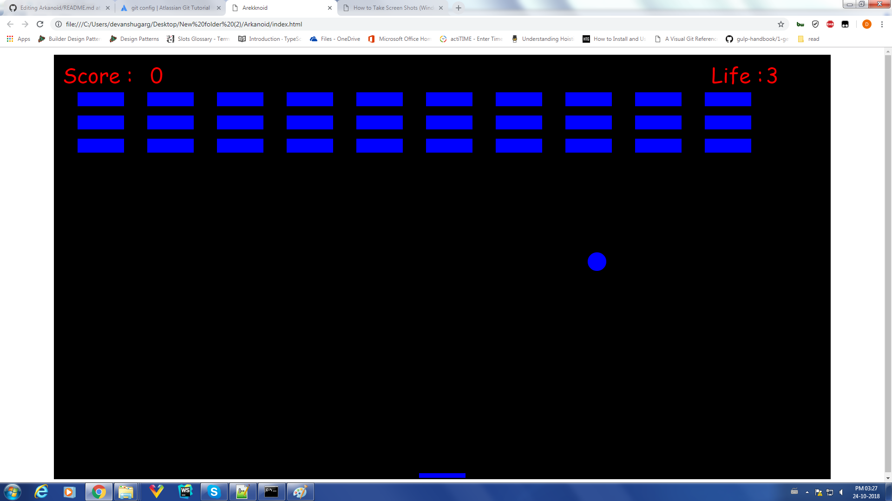
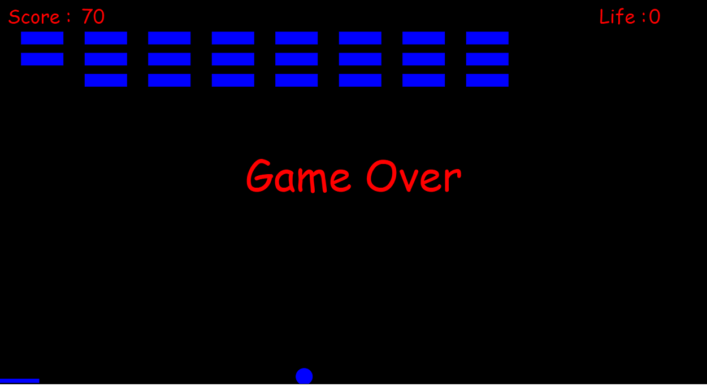

# Arkanoid
 It is a simple implementation of the Game Arkenoid which is build using canvas and script is wrtten in Javascript.
 The game have 30 bricks and we have to distroy all bricks by colloiding the ball with bricks.
 We have ensure that when the ball come downward it should land safely on the paddale, if not then we get out and our life value decreased.
 We have only 3 life within which we have to to destroy all bricks.
 Each brick when destryed a 10 points is awarded to the player.
 
 Opening Scene :
 
 When game Start  
 
 
 
 
 When game ends without distroying all bricks and all 3 life are consumed then Game Over!
  
 
 
